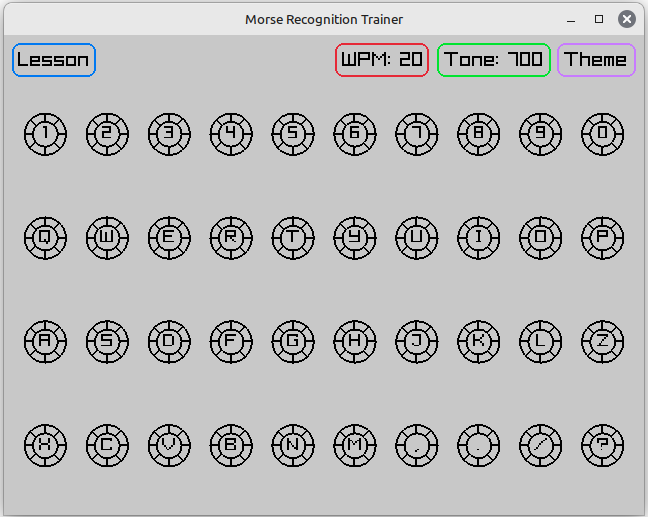

# Morse Recognition Trainer



A simple cross platform app to learn morse using a sort of Koch inspired method. 
Built with C and Raylib.

FYI: This contains no generated code from the likes of ChatGPT/Copilot. Pure spartans way for the win!

## Download

I currently make binaries for Linux, Windows and Android. You can download them on the [releases page](https://github.com/M0JXD/morse-recognition-trainer/releases).

You can also try it out on the web here, although you're progress will not be saved: https://m0jxd.github.io/morse-recognition-trainer/

Due to not owning Apple devices and an [unwillingness to break their EULA's](https://www.google.com/search?q=is+cross+compiling+for+mac+allowed&hl=en), 
macOS binaries are not provided, although it should build and run. iOS is waiting on Raylib to gain iOS support, but likewise I couldn't provide such binaries anyways...

## User Guide

When opening, the app defaults to `REPEAT` mode, where clicking/tapping/typing the letters will simply play the morse for that letter, letting you know in the at the bottom which letter is playing. This is useful if you want to hear the letters outside of lessons. The letters will still be highlighted with your progress from Lesson Mode.

Press the top right button change modes. It cycle through three modes: `REPEAT`, `LESSON` and `EVERYTHING`.

In `LESSON` Mode, you will only be quizzed on currently active letters. They are marked with a filled center.
Letters are introduced in the Koch order, the same as the LCWO.

The morse for an active letter will play. Enter the right letter, and the meter for the letter will progress a segment.
Once you reach two segements for a letter, the next letter will be introduced. Newly introduced letters are always asked when they are added.
If you don't know the morse for the introduced letter, you can switch back to Repeat mode :)

If you get the letter wrong, a buzzer noise will occur and the progress meter for the letter you should have pressed will regress.
It will also repeat the morse for you. Subsequent incorrect inputs will not affect the status, but the program will wait until you enter the correct answer. Also, because you did not get it right on the first try, the letter will not progress when you get it right.

If you drop to zero segements for an active letter, the program reverts back to the lesson of which that letter was introduced. There's no easy way to approach this better, as the Koch method relies on you knowing all the letters of the previous lesson before moving on. Hopefully this should be a rare occurence for most learners!

`EVERYTHING` mode is similar to `LESSON` mode, but activates all possible letters at once and quizzes you at random. 
There are no progress meters/saves for this mode - instead, to signify everything mode, all letter centers are filled, and the progress rings are filled to be the same colour as the everything button.

The `THEME` button changes the light/dark theme. The `WPM` and `TONE` buttons cycle through other Sound options.
These preferences, along with the Window size, are saved.

The Koch method recommends listening to letters at 20WPM, so by default morse is at 700Hz tone at 20WPM.

You can create a custom lesson order by adding a text file named "CustomLetters.mrt" in the same folder as the executable.
Place the letters in the order you want on individual lines, an example is in the root of the repo.
You MUST ensure there are 40 entries.

## Installation

On Linux and Windows, this is a portable app that uses the directory it's launched in for saving/loading data and assets.
To make things feel more "installed", you can:

### Windows
Choose where you want to store the app (e.g. Documents\Apps\morse-recognition-trainer), then right click the app and pin to start.

### Linux
Choose where you want to store the app (e.g. ~/Applications/morse-recognition-trainer), and create a desktop entry in .local/share/applications.
Your desktop environment may have a GUI for making desktop entries more easily, e.g. in Cinnamon, right click the menu and select "Edit Menu".

### Android
You will have to sideload the app. It might ask you to scan it which should pass, otherwise you can still select to install anyways.
If you want to reset your progess you can clear the app's data :)

## Compiling

### Desktop
If your platform is not provided for, or you simply want to build from source, you can probably do so by installing [Xmake](https://xmake.io/#/guide/installation) and running:

```
xmake f -m release
xmake
```

Then look in `build/(PLATFORM)/(ARCH)` and for the `release` folder, which contains the executable and the assets it requires.. 
You can move and rename this folder to `morse-recognition-trainer` or whatever you wish, although you must retain it's internal structure with the assets folder in the same directory as the binary.

If Xmake complains about being unable to install Raylib, try installing your distro's openGL dev packages (e.g. libopengl-dev/libgl-dev for Ubuntu). 

### Android

Requires Android Studio - see the raymob branch. I had to add the .h files the the CMakeLists.txt SOURCE glob, but the rest is pretty straightforward.
The Android Build is a debug one with the debug signing key, as I have no intention of paying Google so I can "sign" it and put it on the Play Store.

### Web

See the emscripten branch for web deployment. Follow Raylib's HTML guide in their wiki to create libraylib.a. I cloned raylib into the root of this repo, so from the src folder my compile command was:

`emcc -o index.html main.c game_save.c lessons.c letters.c morse.c -Os -Wall ../raylib/src/libraylib.a -I. -I../raylib/src -L. -s USE_GLFW=3 -s ASYNCIFY -DPLATFORM_WEB --preload-file ../assets`

Which will generate four files, index.html, index.wasm, index.data and index.js. Put them in the root of a repo and deploy via github pages, easy as that!

## Credits
- Made for my Dad, love you!! xx
- Inspired by [Morse Trainer for Windows 10](https://apps.microsoft.com/detail/9wzdncrdlzhg?hl=en-us&gl=US), which sadly became a paid app, and only ran on Windows anyways.
- Thanks to raysan5 and all the contributors of [Raylib](https://www.raylib.com/)
- Thanks to BigFoot71 for Raymob
- Thanks to Meridian Outpost's website for the Morse files: https://www.meridianoutpost.com/resources/etools/calculators/calculator-morse-code.php?
- Thanks to this video for the CC0 buzzer sound: https://www.youtube.com/watch?v=L0atHn_vPS4
- Thanks to Ruki for Xmake
- Thanks to https://icon.kitchen for the easy to use Android Icon Set Generator
- And everyone else's work which this project relies on... Emscripten, GNU, Linux, Microsoft, Google... thank you :)