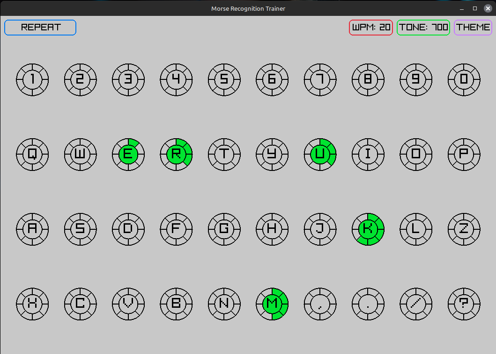

# Morse Recognition Trainer



A simple cross platform app to learn morse using a sort of Koch inspired method. 
Built with C and Raylib.

FYI: This contains no generated code from the likes of ChatGPT/Copilot. Pure spartans way for the win!

## Download
I currently make binaries for Linux and Windows. You can download them on the [releases page](https://github.com/M0JXD/morse-recognition-trainer/releases).
I'm planning to make a release for Android.

You can also try it out on the web here, although you're progress might not be saved: https://m0jxd.github.io/morse-recognition-trainer/

Due to not owning Apple devices and an [unwillingness to break their EULA's](https://www.google.com/search?q=is+cross+compiling+for+mac+allowed&hl=en), macOS binaries are not provided, although it should build and run. iOS is waiting on Raylib to gain iOS support, but likewise I couldn't provide binaries anyways...

## User Guide

When not in Lesson Mode, clicking/tapping/typing the letters will simply play the morse for that letter, letting you know in the at the bottom which letter is playing. This is useful if you want to hear the letters outside of lessons. The letters will still be highlighted with your progress from Lesson Mode.

Press `Lesson` to start lesson mode, it will change to a filled button. You can press `Lesson` again at any time to return to the default mode.

In Lesson Mode, you will only be quizzed on currently active letters. They are marked with a green center.
Letters are introduced in the Koch order, the same as the LCWO. The currently active letters are played at random.

The morse for an active letter will play. Enter the right letter, and the meter for the letter will progress a segment.
Once you reach two segements for a letter, the next letter will be introduced. 
If you don't know the morse for the introduced letter, you can switch back to Repeat mode :)

If you get the letter wrong, the progress meter for the letter you should have pressed will regress. 
Subsequent incorrect inputs will not affect the status, but the program will repeat the letter with each incorrect input until you enter the correct answer. 
Because you did not get it right on the first try, the letter will not progress when you get it right.

If you drop to zero segements for an active letter, the program reverts back to the lesson of which that letter was introduced. There's no easy way to approach this better, as the Koch method relies on you knowing all the letters of the previous lesson before moving on. Hopefully this should be a rare occurence for most learners!

The `Theme` button changes the light/dark theme. The `WPM` and `Tone` buttons cycle through other options.
These preferences, along with the Window size, are saved.

The Koch method recommends listening to letters at 20WPM, so by default morse is at 700Hz tone at 20WPM.


## Installation

On Linux and Windows, this is a portable app that uses the directory it's launched in for saving/loading data and assets.
To make things feel more "installed", you can:

### Windows
Choose where you want to store the app (e.g. Documents\Apps\morse-recognition-trainer), then right click the app and pin to start.

### Linux
Choose where you want to store the app (e.g. ~/Applications/morse-recognition-trainer), and create a desktop entry in .local/share/applications.
Your desktop environment may have a GUI for making desktop entries more easily, e.g. in Cinnamon, right click the menu and select "Edit Menu".

## Compiling
If your platform is not provided for, or you simply want to build from source, you can probably do so by installing [xmake](https://xmake.io/#/guide/installation) and running:

```
xmake f -m release
xmake
```

Then look in `build/(PLATFORM)/(ARCH)` and for the `release` folder, which contains the executable. 
You can move and rename this folder to `morse-recognition-trainer` or whatever you wish, although you must retain it's internal structure with the assets folder in the same directory as the binary.

Which will create a folder called morse-recognition-trainer containing the executable and the assets it requires.
For Android, the build will be more complicated. See Raymob.
See the emscripten branch for web deployment - there is a text file showing the compile command, otherwise follow Raylib's HTML guide :)

## Credits
Made for my Dad, love you!! xx <br>
Inspired by [Morse Trainer for Windows 10](https://apps.microsoft.com/detail/9wzdncrdlzhg?hl=en-us&gl=US), which sadly became a paid app and only ran on Windows anyways. <br>
Thanks to Raysan5 and all the contributors to Raylib! <br>

## TODO
12WPM option <br>
Time how long to get them, maybe have a timeout <br>
Better algo that focuses on lower rated options - use times from above <br>
"Got it wrong" sound <br>
Right click to activate all letters for random quiz <br>
For above: Have modes on the lesson button - REPEAT, LESSON, EVERYTHING <br>
Build for Web <br>
Build for Android <br>